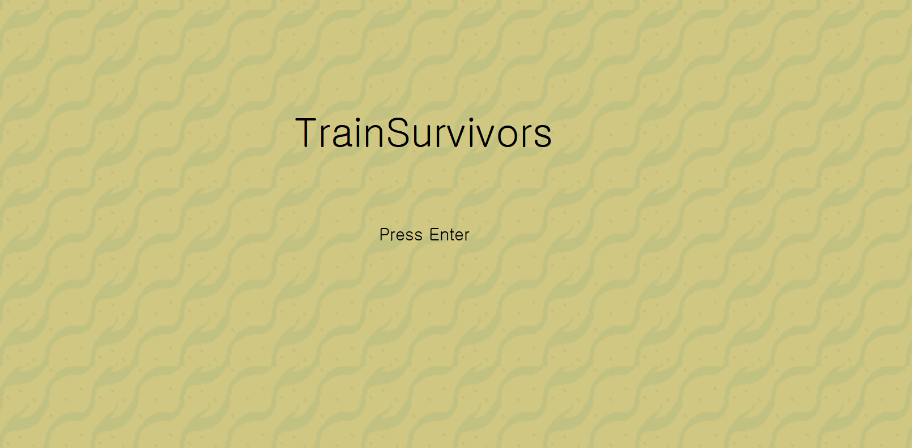
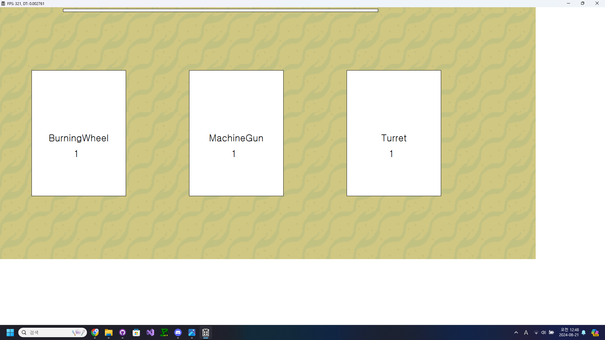
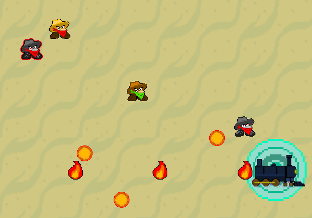
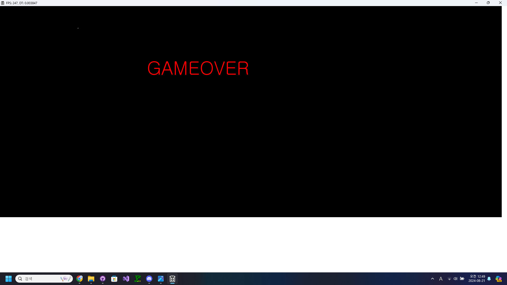

# TrainSurvivors

[**다운로드 바로가기**](https://drive.google.com/file/d/1Y9k39UzPSzhdsM7bOCrZ4aeAIzaYwtBg/view?usp=sharing)

좌우로 움직이는 열차를 조작해 생존하는 생존 게임입니다.

 

## 조작 방법

화살표 키 좌, 우 : 이동

## 게임 요소

### 레벨 업 강화
레벨이 오르면 랜덤한 3개의 무기 중 원하는 무기를 강화할 수 있습니다.
무기는 최대 6개까지 얻을 수 있습니다.

### 적
적들은 기차를 향해 끊임없이 달려오는 열차 강도들 입니다.
일정한 데미지를 입히면 처치할 수 있으며, 처치할 경우 경험치를 얻을 수 있습니다.

### 게임 오버
적들의 수를 감당하지 못하고 닿아버릴 시 게임 오버 됩니다.
게임을 한번 껐다 키는 것으로 다시 시작할 수 있습니다.

 
